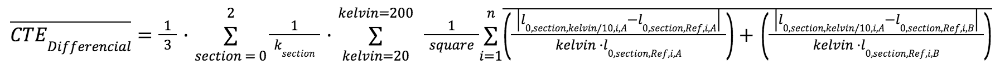
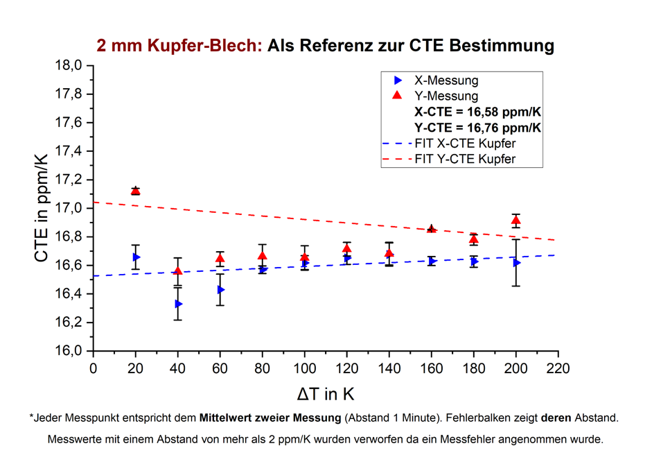

# aramis-to-cte-excel-converter
This software is used for measurements from ARAMIS Differencial Image Correlation (DIC) for calculation of the the thermal expansion coefficient (CTE).

To do so you need to know a lot about the data structure which will be explained in a later commit.

Currently it is simple the submission for a master thesis.

# Installation
```
python3 -m pip install pandas numpy matplotlib rich alive_progress openpyxl warnings
```

# Running
```
python3 getCTExcel.py 
```


finally it results in:


and some Excel Files in the current folder

# Results
From the Excelfiles one can make plots. In my case I used Origin Pro. Each Excelfile has multiple cols but three important (CTE, diffCTE, InterStageCTE):





**The given measurments in the /tests folder are transit liquit phase (TLP) foils from 30 µm Ag and 5 µm In and 5 µm Sn !!!**

(... means they are not linear on the hotplate... this was the reason for doing my reasearch about the methods to measure it the right way)

## Inter Stage CTE

## Differencial CTE

## CTE over the hole length of the probe

