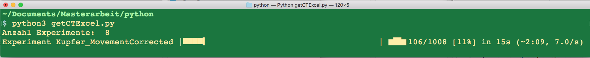

# aramis-to-cte-excel-converter
This software is used for measurements from ARAMIS Differencial Image Correlation (DIC) for calculation of the the thermal expansion coefficient (CTE).

To do so you need to know a lot about the data structure which will be explained in a later commit.

Currently it is simple the submission for a master thesis.

# Installation
```
python3 -m pip install pandas numpy matplotlib rich alive_progress openpyxl warnings
```

# Running
```
python3 getCTExcel.py 
```



finally it results in:


and some Excel Files in the current folder
